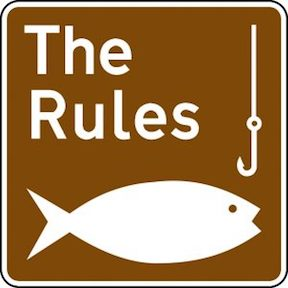

---
title:
author: "cjlortie"
date: "2018"
output:
  html_document:
    theme: lumen
    toc: yes
    toc_depth: 3
    toc_float: yes
  pdf_document:
    toc: yes
---
###A synthesis of the ten simple rules format in scientific discourse
<br>

<center>

</center>  

###Purpose  
The primary goal here is to highlight that simple rules in science can strongly inform novice and expert scientists alike and provide a rapid roadmap to advance understanding for a specific topic.  The impact is explored using conventional bibliometric estimates.  Independent of the impact of these contributions to the peer-reviewed literature, this paper format can provide an overview of a topic and function as a mechanism to synthesize evidence.  With the significant volume of scientific resoures available to the community including publications, data, blog posts, texts, vignettes, and technical resources, synthesis tools that succinctly direct, aggregate, and inform readers are increasingly important. 

###Ten simple rules for rules


###Data
```{r, data, warning=FALSE, message=FALSE}
library(tidyverse)
data <- read_csv("data/ten.simple.rules.csv") #bibliometric returns from the Web of Science
data <- data %>%
  select(paper, authors, journal, year, DOI, citations, citations.yr)
data

```

###Ideas
1. Uptake in teaching contexts.
2. Presentations and slide decks that are often used to communicate and further share the rules.
3. Secure altmetric measures of performance for each paper, i.e. 22,000 views on a given ten simple rules papers is a significant contribution to the community.
4. Summarize the success of the most 'successful' papers, highlight salient elements across all papers, and do a narrative review of summary of the breadth of the field.
5. Scrape first author data for each publication.
